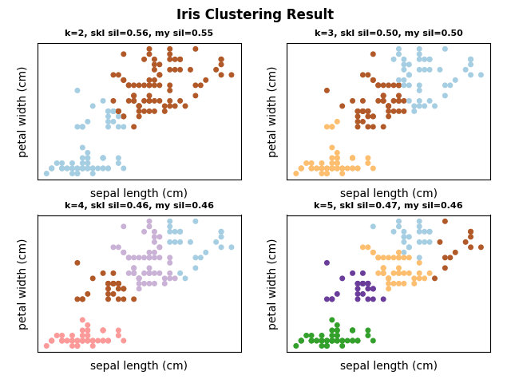
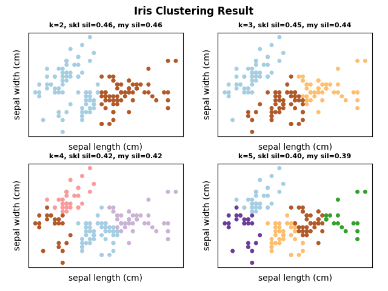
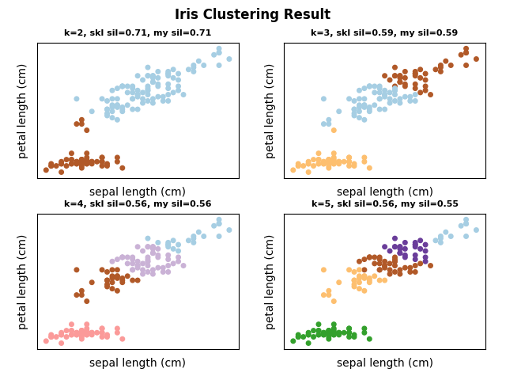

# Overview
Implement the silhouette coefficient just for fun :)

# Requirement
- sklearn
- numpy
- tqdm

# Result
- My silhouette coefficient vs sklearn's silhouette coefficient
- Test by Iris dataset

